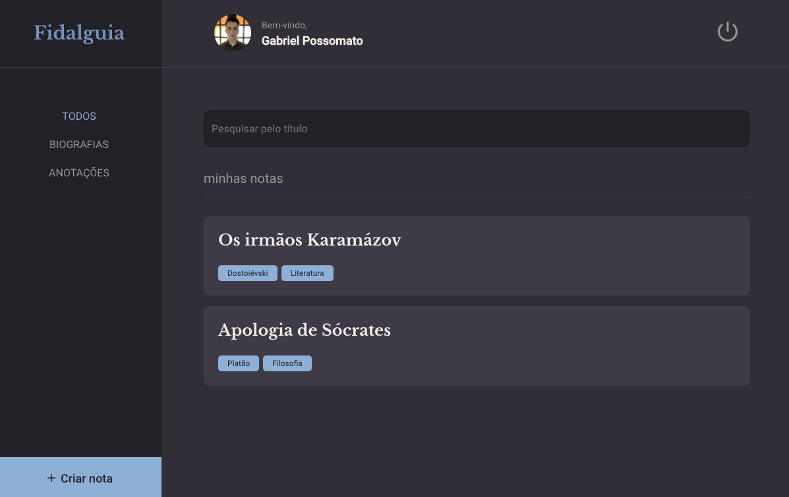
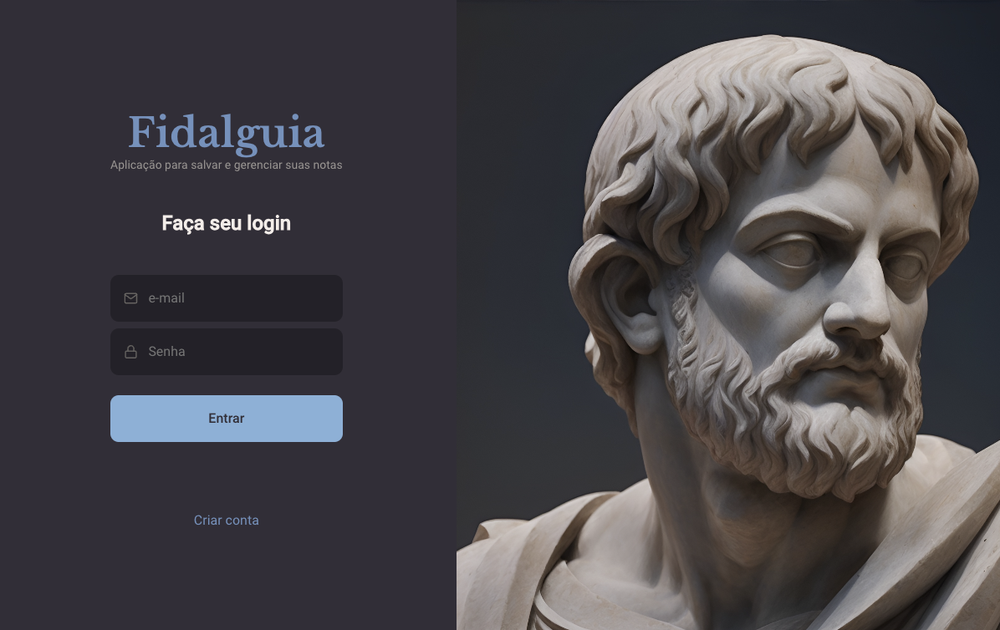

# Fidalguia - Organizador de Estudos 📚

Bem-vindo ao repositório do projeto Fidalguia! O Fidalguia é um site desenvolvido com React.js, HTML e CSS, utilizando o React Router para a navegação, o React Icons para a inclusão de ícones e o Vite para o desenvolvimento rápido. Este projeto tem como objetivo principal oferecer uma plataforma para salvar e organizar notas de estudo de grupos de estudos. A parte do front-end já foi completamente desenvolvida e os próximos passos envolvem a criação de uma API Restful para autenticação de usuários, gerenciamento de uploads e a integração desta API com o front-end. Além disso, planejamos fazer o deploy tanto do front-end quanto do back-end para disponibilizar o projeto online.

 

## 🚀 Funcionalidades Atuais

- Navegação suave entre diferentes seções do site usando o React Router.
- Utilização de ícones intuitivos e visualmente agradáveis do React Icons.
- Interface responsiva e atraente desenvolvida com HTML e CSS.
- Possibilidade de adicionar, editar e excluir notas de estudo.
- Categorização das notas para uma melhor organização.
- Visualização clara das notas e opções de edição.

## 🛠️ Tecnologias Utilizadas

- **React.js**: Biblioteca JavaScript para a construção de interfaces de usuário.
- **HTML**: Linguagem de marcação para estruturar o conteúdo da web.
- **CSS**: Linguagem de estilo para aprimorar a aparência das páginas web.
- **React Router**: Biblioteca de navegação que ajuda a criar roteamentos dinâmicos no React.
- **React Icons**: Conjunto de ícones populares para utilização no React.
- **Vite**: Build tool e bundler rápido para projetos web.

## 🔜 Próximos Passos

1. **Criação da API Restful**: Desenvolver uma API para gerenciar a autenticação de usuários, bem como permitir o upload e a recuperação das notas de estudo. Será utilizada uma estrutura que segue as melhores práticas de design de APIs REST.

2. **Integração Front-end e Back-end**: Conectar o front-end existente à nova API para possibilitar o registro de usuários, autenticação e manipulação das notas de estudo.

3. **Implementação de Autenticação**: Criar um sistema de autenticação seguro para os usuários, garantindo que apenas usuários autorizados possam acessar e gerenciar as notas.

4. **Gerenciamento de Uploads**: Permitir que os usuários façam upload de arquivos relacionados às notas de estudo, como imagens, documentos e outros recursos relevantes.

5. **Testes e Validação**: Realizar testes abrangentes tanto no front-end quanto no back-end para garantir o bom funcionamento de todas as funcionalidades, bem como a segurança e a robustez do sistema.

6. **Configuração de Ambiente de Produção**: Preparar o projeto para o ambiente de produção, configurando variáveis de ambiente e ajustando as configurações para garantir um desempenho otimizado.

7. **Deploy**: Fazer o deploy do front-end e do back-end em servidores apropriados, garantindo que o projeto esteja acessível online para os usuários.

## 🤝 Contribuindo

Se você gostaria de contribuir para o projeto Fidalguia, fique à vontade para fazer um fork deste repositório, criar branches para suas modificações e enviar pull requests. Ficaremos felizes em revisar suas contribuições!

## 📬 Contato

Se você tiver alguma dúvida, sugestão ou comentário, sinta-se à vontade para entrar em contato conosco através das issues deste repositório.

Vamos construir o Fidalguia juntos e criar uma plataforma útil para a organização de notas de estudo de grupos de estudos!

## Autor 👨‍💻

<a href="https://possomato.vercel.app/" target="_blink">Gabriel Bonifacio Possomato</a>
